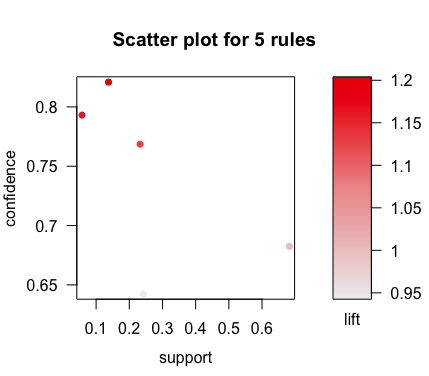
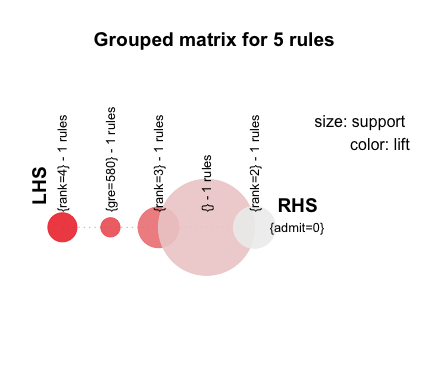
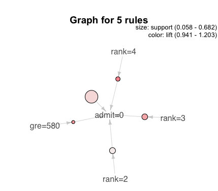
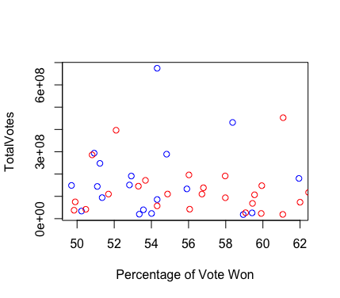

# Lab 7
3. 
```
> rules.all <- apriori(admissions)
Apriori

Parameter specification:
 confidence minval smax arem  aval originalSupport maxtime support minlen
        0.8    0.1    1 none FALSE            TRUE       5     0.1      1
 maxlen target   ext
     10  rules FALSE

Algorithmic control:
 filter tree heap memopt load sort verbose
    0.1 TRUE TRUE  FALSE TRUE    2    TRUE

Absolute minimum support count: 40 

set item appearances ...[0 item(s)] done [0.00s].
set transactions ...[164 item(s), 400 transaction(s)] done [0.00s].
sorting and recoding items ... [6 item(s)] done [0.00s].
creating transaction tree ... done [0.00s].
checking subsets of size 1 2 done [0.00s].
writing ... [1 rule(s)] done [0.00s].
creating S4 object  ... done [0.00s].
> rules.all
set of 1 rules 
> inspect(rules.all)
    lhs         rhs       support confidence lift    
[1] {rank=4} => {admit=0} 0.1375  0.8208955  1.202777
```
With lower parameters:
```
> rules.all <- apriori(admissions, parameter = list(supp=0.05, conf=0.6))
Apriori

Parameter specification:
 confidence minval smax arem  aval originalSupport maxtime support minlen
        0.6    0.1    1 none FALSE            TRUE       5    0.05      1
 maxlen target   ext
     10  rules FALSE

Algorithmic control:
 filter tree heap memopt load sort verbose
    0.1 TRUE TRUE  FALSE TRUE    2    TRUE

Absolute minimum support count: 20 

set item appearances ...[0 item(s)] done [0.00s].
set transactions ...[164 item(s), 400 transaction(s)] done [0.00s].
sorting and recoding items ... [19 item(s)] done [0.00s].
creating transaction tree ... done [0.00s].
checking subsets of size 1 2 done [0.00s].
writing ... [5 rule(s)] done [0.00s].
creating S4 object  ... done [0.00s].
> rules.all
set of 5 rules 
> inspect(rules.all)
    lhs          rhs       support confidence lift     
[1] {}        => {admit=0} 0.6825  0.6825000  1.0000000
[2] {gre=580} => {admit=0} 0.0575  0.7931034  1.1620563
[3] {rank=4}  => {admit=0} 0.1375  0.8208955  1.2027773
[4] {rank=3}  => {admit=0} 0.2325  0.7685950  1.1261466
[5] {rank=2}  => {admit=0} 0.2425  0.6423841  0.9412221
```
4.







5. 
### Elect
 States Bush Won (31 Total):
 
Alabama
Alaska
Arizona
Arkansas
Colorado
Florida
Georgia
Idaho
Indiana
Iowa
Kansas
Kentucky
Louisiana
Mississippi
Missouri
Montana
Nebraska
Nevada
New Mexico
North Carolina
North Dakota
Ohio
Oklahoma
South Carolina
South Dakota
Tennessee
Texas
Utah
Virginia
West Virginia
Wyoming

```
> states <- subset(elect, BushPct > KerryPct)
```



The states that Bush won were generally won by a higher percentage than the states that Kerry won. Kerry also won a greater number of states with high total vote counts.

### Topmovies

 133 movies are sequels
 ```
 sequels <- 0
for(n in topmovies$name) {
  sequels <- sequels + startsWith(n, topmovies$name) 
}
sequels = sequels - 1
sequels = sum(sequels[sequels != 0])
```

 20 movies have the word 'man' in them.
 ```
 > length(grep("man", topmovies$name))
[1] 20
```

There are 6 Star Wars movies.
```
> length(grep("Star Wars", topmovies$name))
[1] 6
```

```
> summary(topmovies$box)
   Min. 1st Qu.  Median    Mean 3rd Qu.    Max. 
  52.58   70.28   93.60  117.50  134.60  759.60 
 ```
