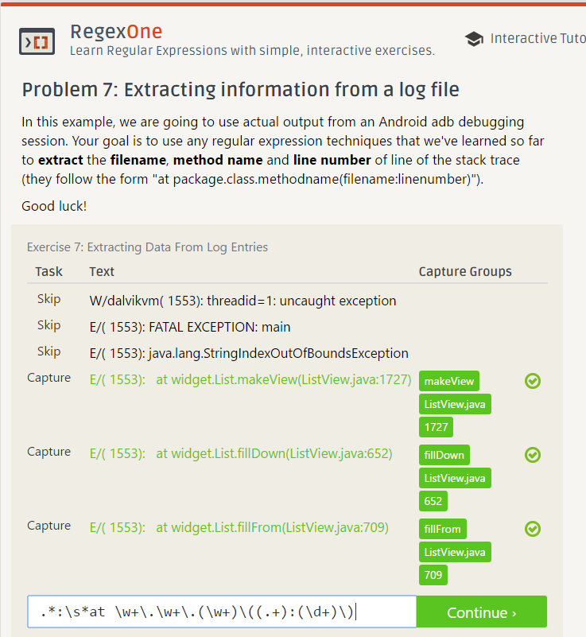
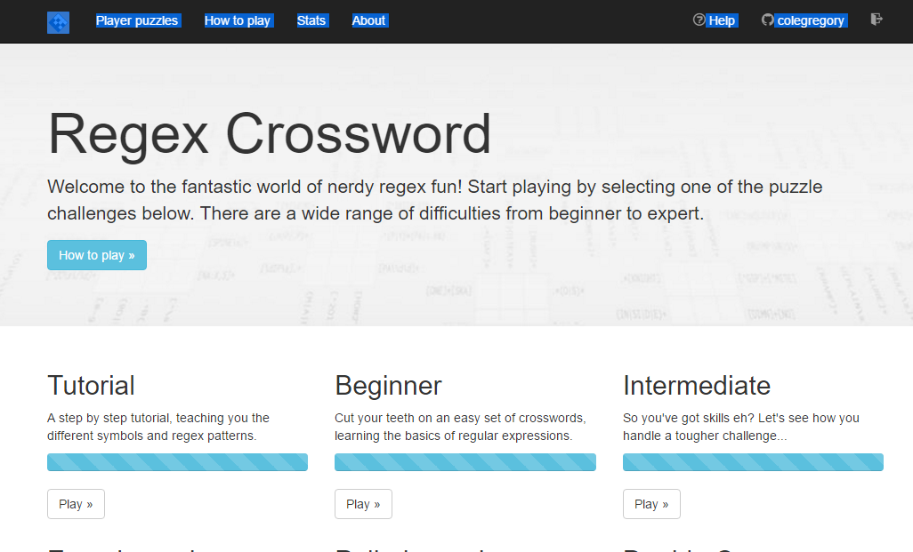

## c. Reading Assignments
2. How To Answer Questions in a Helpful Way
 * Make instructions as clear and easy to follow as possible.
 * If you don't know the exact answer to the question, provide helpful material that the person could research. 
3. Free Culture CH. 3
 Jesse Jordan's story is an example of current copyright laws restricting creativity and the creation of new technology. His only modification to the Microsoft search engine was a bug fix that helped prevent the program from crashing when it would connect to off-line copmuters. So, he was essentially punished for improving Microsoft's program. The RIAA's lawsuit against him for $15,000,000 was completely absurd. Jesse shouldn't be punished for the actions of people using his software. He has no control over what other people choose to do. In my opinion, it is completely unfair and immoral for such a large entity to go after individuals in that way. Especially when the RIAA isn't actually the content creator. The artists themselves would never see that money. 

## d. Linux

## e. Regex

## f. Blockly Maze

## g. Reflection
