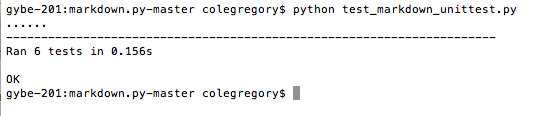

##Part 0:
`$\sqrt{1+2\sqrt{1+3\sqrt{1+4\sqrt{1+...}}}}$`


`$\sqrt{2}^{\sqrt{2}^{\sqrt{2}^{\sqrt{2}}}}$`


```
\[
H_4 =
\begin{bmatrix}
    1 & 1 & 1 & 1\\
    -1 & 1 & -1 & 1\\
    -1 & -1 & 1 & 1\\
    1 & -1 & -1 & 1 
\end{bmatrix}
\]
```


##Part 1:
###Projects 36 - 37

whenisbest 

1.
  number of contributors : 6
  number of lines of code : 6135
  the first commit : Oct 2, 2016
  the latest commit : Feb 14, 2017
  the current branches : Erin's_CSS
                         homepage
                         master
                         small_fixes
                         test_branch
                         user_interface 
                         
2.
With gitstats
  number of contributors : 7
  number of lines of code : 3394
  the first commit : 2016-10-02 17:25:09 
  the latest commit : 2017-02-14 16:13:26

-listing the number of files with `git ls-files -z | xargs -0 wc -l`

3. 
[Youtube Link to Gource Video](https://www.youtube.com/watch?v=BXgDmAq4KvA&feature=youtu.be)

The leader seems to be Zefanya Putri.

##Part 2:
[code](https://github.com/colegregory/Labs/blob/master/markdown.py)

[testcode](https://github.com/colegregory/Labs/blob/master/test_markdown_unittest.py)




